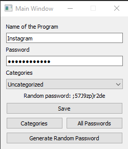
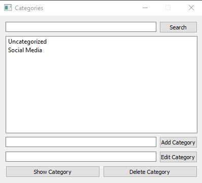
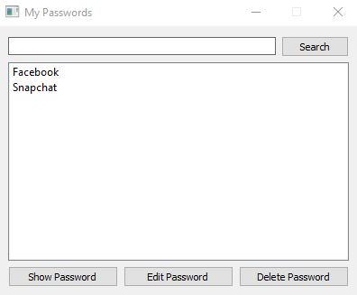
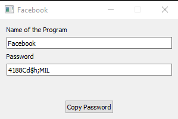

# PyPassKeeper
Password keeper with random password generator.
# Requirements
- PyQt5
- PyQt5-tools
- pyperclip
```
pip install pyqt5
pip install pyqt5-tools
pip install pyperclip
```
# Features
Let the program store your passwords. Now you only need to remember 1 password and that is the password of this program haha!
1. You can save your passwords.
<br> <br>


2. You can categorize your passwords and you can see them in categories
<br> <br>


3. If you want, you can view all your passwords in one place.
<br> <br>


4. And whenever you want, find your saved password in four clicks.
<br> <br>


5. It's that simple! 
